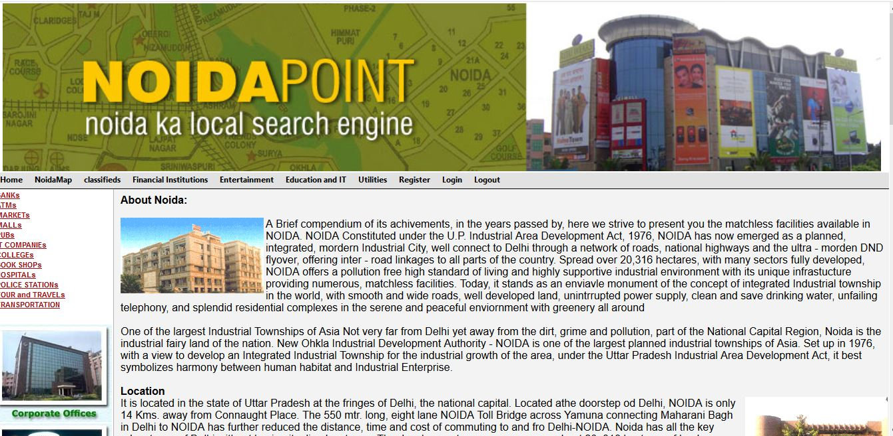

# Noida-Point
It is a webpage application. By the help of this portal the  user can get all type of information of noida like colleges , hospitals ,banks, Atms, shopping malls, markets etc.  
<b>Technologies used</b> 
 <b>Front End-</b> HTML, CSS, JavaScript, JSP. 
<b>Back End-</b> Servlets, Java Beans. 
<b>Database-</b> Oracle DB Connectivity. 
 

